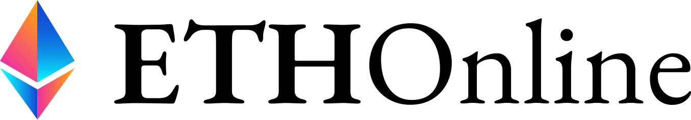
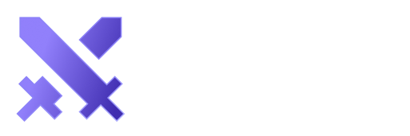
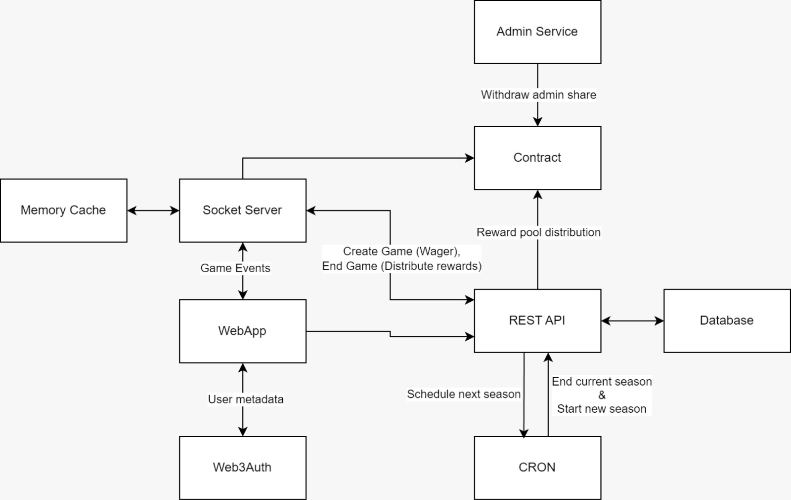
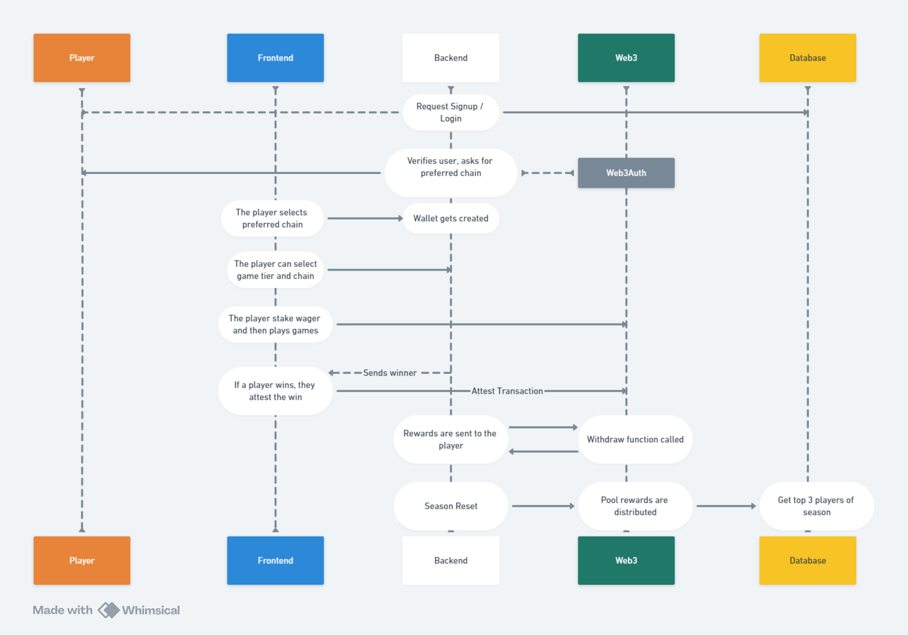

  

 

  

<blockquote align="center"> 
  Built with ❤️, delivered on ☕</a>.
</blockquote>

 

# 💡 **Problem Statement**

Traditional arcade gaming lacks a mechanism for players to bet across various chains on their own performance in a secure and transparent way, limiting the potential for true competitive play and financial engagement. Additionally, current systems lack the ability to verify wins and results in a provable, immutable manner, leading to trust issues in competitive scenarios.

# 🧠 **Knowledge Primer**

1. **1V1 Games:** Players can play live, turn-based 1v1 games with each other by wagering a certain amount.
2. **Tiers:** Division of the playing class based on the wager amount each player has to stake. Every tier has its unique `point weightage` that is used for points calculation.
3. **Seasons:** Dewls has weekly seasons starting on Monday midnight UTC and ends on Sunday midnight UTC. The `leaderboard` refreshes with every season.
4. **Reward Pool:** Every game played by the players has a fixed percentage of the total amount wagered for the game in the `tier` that is added to the `season`'s Reward Pool. At the end of each season, this reward pool is distributed amongst the top three players.
5. **Leaderboard:** Players are assigned a rank that changes on the players win. At the end of each `season`, the seasons reward pool is distributed amongst the top three players of the said season.

# 📺 **Previews**

# 💻 **Tech Stack**

- NextJS
- ReactJS
- TypeScript
- NodeJS
- ExpressJS
- Solidity
- Supabase
- Redis
- Socket.IO Protocol
- Hedera HCSC
- Hedera HTS
- XMTP Subscribe

# 📦 **Inside the box**
DEWLS features a robust system architecture to support these actions, along with a streamlined user flow within the web application. The following diagrams explain the same:

### 1. **System Architecture Diagram**

### 2. **Flow Diagram**

# ⏭️ **What's next for DEWLS?**

- With its proof-of-win mechanism and the ability to wager on oneself, DEWLS could become an ideal platform for competitive esports. This could lead to partnerships with gaming organizations and sponsorship opportunities, as the platform could facilitate tournaments where players or teams bet on their own performance, creating higher stakes for professional gameplay.
- With the multi-chain capability already part of the platform’s core, DEWLS can expand by integrating with more blockchains, creating a truly cross-chain gaming ecosystem. This will allow players from different blockchain networks to participate seamlessly, increasing the platform’s user base and liquidity.
- DEWLS could collaborate with third-party developers to build a diverse library of arcade games that leverage the platform's betting and blockchain infrastructure. By providing incentives for developers to create games that align with DEWLS's vision, the platform could foster a larger ecosystem of blockchain-based arcade games, further driving user growth.

# 📜 **License**

`dewl` is available under the MIT license. See the [`LICENSE`](./LICENSE) file for more info.

# 🤝 **Contributing**

Please read [`CONTRIBUTING.md`](./CONTRIBUTING.md) for details on our code of conduct, and the process for submitting pull requests to us.

# 💥 **Contributors**

# 🚨 **Forking this repo**

Many people have contacted us asking if they can use this code for their own websites. The answer to that question is usually "yes", with attribution. There are some cases, such as using this code for a business or something that is greater than a personal project, that we may be less comfortable saying yes to. If in doubt, please don't hesitate to ask us.

We value keeping this site open source, but as you all know, _**plagiarism is bad**_. We spent a non-negligible amount of effort developing, designing, and trying to perfect this iteration of our website, and we are proud of it! All we ask is to not claim this effort as your own.

Refer to this handy [Quora post](https://www.quora.com/Is-it-bad-to-copy-other-peoples-code) if you're not sure what to do. Thanks!
